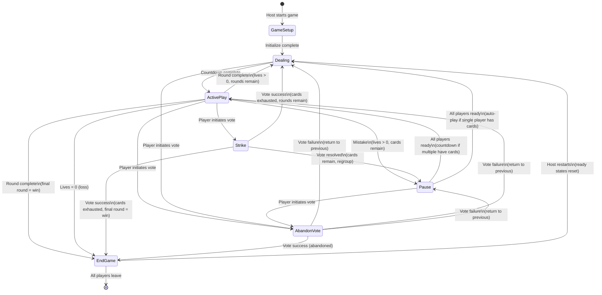

# Shoebill Strike - Game Rules Breakdown

## Overview
Shoebill Strike is a cooperative card game where players work together to play numbered
cards (1-100) in ascending order without communication. Players must develop a
shared sense of timing to know when to play their cards.

The core challenge: with no communication allowed, players must "feel" when it's
the right moment to play their card. Lower cards should be played sooner, but
how soon? That intuition is what makes the game unique.

## Setup Configuration

| Players | Starting Cards | Lives | Strikes | Total Rounds |
|---------|----------------|-------|----------------|--------------|
| 2       | 1              | 2     | 1              | 12           |
| 3       | 1              | 3     | 1              | 10           |
| 4       | 1              | 4     | 1              | 8            |

- **Player count:** 2-4 players required (cannot start or restart with fewer than 2)
- **Round:** Each round N, every player receives N cards (Round 1 = 1 card each, Round 5 = 5 cards each, etc.)

## Level Completion Rewards

| Completed Level | Reward          |
|-----------------|-----------------|
| 2               | 1 Strike |
| 3               | 1 Life          |
| 5               | 1 Strike |
| 6               | 1 Life          |
| 8               | 1 Strike |
| 9               | 1 Life          |

## State Transitions



## Game Phases

### 0. Game Setup Phase (server-side only)
**Purpose:** Initialize game configuration based on current player count

**Note:** This phase is not visible to clients. It exists to clarify server state transitions. Clients transition directly from Lobby/EndGame to Dealing.

**Entry:**
- Host starts game from lobby, OR
- Host restarts game from End Game Phase (all players ready)

**Actions:**
- Count current players
- Compute lives and strikes based on player count (see Setup Configuration)
- Set round to 1
- Shuffle fresh deck (1-100)
- Immediately transition to Dealing Phase

**State:**
- Player count
- Lives (computed)
- Strikes (computed)
- Current round (1)
- Shuffled deck

### 1. Dealing Phase
**Purpose:** Prepare players for the current round

**Actions:**
- Deal each player N cards (where N = current round number)
- Players receive cards face-down and view them privately
- Display ready button for each player
- Wait for all players to indicate readiness
- Once all ready, send latency ping to all players before countdown
- Show countdown (3-2-1)
- During countdown: ready button disabled, server ignores unready requests
- Transition to Active Play Phase

**State:**
- Current round number
- Cards dealt to each player
- Ready status for each player
- Lives remaining
- Strikes remaining

### 2. Active Play Phase
**Purpose:** Play cards in ascending order

**Actions:**
- Players place one hand on table to focus (ceremonial start)
- Players can only play their lowest card
- Any player can play at any time
- Cards must be played in ascending order on central stack
- No communication about card values allowed
- Monitor for mistakes (played card is higher than another player's lowest card)
- Simultaneous plays: server uses latency compensation to resolve (see Mistake Detection)

**Mistake Detection (with Latency Resolution):**
- When a card is played that appears out of order, server enters MistakeResolution:
  1. Start buffer timer: `min(max(player_latencies) / 2, 500ms)`, default 300ms if no data
  2. Collect PlayCard messages in Dict keyed by `user_id` (deduplicates naturally)
  3. Block vote initiation (strike, abandon) during buffer window
  4. Ignore duplicate PlayCard from same user
  5. When timer expires:
     - Adjust timestamps: `effective_time = server_receive_time - (latency / 2)` (default latency: 25ms)
     - Tiebreaker for identical adjusted timestamps: FIFO (original arrival order)
     - Sort cards by adjusted timestamps
  6. Check if adjusted order is valid (ascending)
- If adjusted order is valid:
  - Apply all cards in adjusted order
  - Check if any player has card < new pile top
    - If yes → still a mistake (those players should have played)
    - If no → continue ActivePlay, check Round Completion
- If adjusted order invalid OR remaining lower cards exist:
  - Discard all cards lower than pile top
  - Lose one life (regardless of how many cards discarded)
  - If lives reach zero → End Game Phase (loss)
  - If all cards exhausted → check Round Completion (see below)
  - Otherwise → Pause Phase
- PlayCard messages during Pause phase → rejected

**Strike Usage:**
- Any player can initiate a strike vote
- Transitions to Strike Phase for voting

**Round Completion (all cards exhausted):**
- Apply reward milestones if applicable (bonus lives/stars)
- If final round completed → End Game Phase (win)
- Otherwise → increment round, transition to Dealing Phase

### 3. Pause Phase
**Purpose:** Recover from a mistake or regroup after strike vote

**Actions:**
- Display what went wrong (which card was played out of order) if after mistake
- Show remaining lives
- Display ready button for each player
- Wait for all players to indicate readiness
- Once all ready:
  - If only one player has cards → auto-play their cards, advance to Dealing (next round)
  - If multiple players have cards → send latency ping, show countdown (3-2-1), transition to Active Play
- During countdown: ready button disabled, server ignores unready requests

**State:**
- Lives remaining (already decremented during Mistake Detection)
- Cards still in each player's hand
- Current round number
- Ready status for each player

### 4. Strike Phase
**Purpose:** Collective vote to use a strike

**Entry:**
- Any player can initiate a strike vote during Active Play
- Requires at least one strike available
- Only one vote can be active at a time; server ignores duplicate initiation requests

**Actions:**
- Display voting UI to all players
- Each player votes: approve or reject
- 10-second countdown timer starts when phase begins
- Wait for all players to cast votes or timer expiration
- Players who haven't voted when timer expires default to approve

**Vote Success (all approve):**
- Strike is consumed
- Each player with cards discards their lowest card simultaneously
- Players with no cards remaining discard nothing
- Discarded cards are revealed to all players
- If all cards exhausted → check Round Completion (same logic as Active Play)
- Otherwise → Pause Phase (ready states reset, regroup before resuming)

**Vote Failure (any reject):**
- Strike is NOT consumed
- No cards are discarded
- Transition to Pause Phase (ready states reset, regroup before resuming)

**State:**
- Votes cast by each player (persisted across disconnection)
- Players who have not yet voted
- Vote timer remaining (starts at 10 seconds)
- Strikes remaining (decremented only on success)

**Reconnection:**
- Player's vote is preserved if they disconnect after voting
- Reconnecting player receives current vote state (who voted, time remaining)
- If player hasn't voted yet, they can still vote after reconnecting

### 5. Abandon Vote Phase
**Purpose:** Allow players to abandon the match (e.g., if a player permanently disconnects)

**Entry:**
- Any player can initiate an abandon vote
- Can be initiated from: Dealing, ActivePlay, or Pause phases
- Cannot be initiated during: Strike, AbandonVote, or EndGame phases
- Only one vote can be active at a time; server ignores duplicate initiation requests

**Actions:**
- Display voting UI to all players
- Each player votes: approve or reject
- 10-second countdown timer starts when phase begins
- Wait for all players to cast votes or timer expiration
- Players who haven't voted when timer expires default to approve

**Vote Success (all approve):**
- Transition to End Game Phase (abandoned)

**Vote Failure (any reject):**
- Return to previous phase (Dealing, ActivePlay, or Pause)

**State:**
- Votes cast by each player (persisted across disconnection)
- Players who have not yet voted
- Vote timer remaining (starts at 10 seconds)
- Previous phase (to return to on failure)

**Reconnection:**
- Player's vote is preserved if they disconnect after voting
- Reconnecting player receives current vote state (who voted, time remaining)
- If player hasn't voted yet, they can still vote after reconnecting

### 6. End Game Phase
**Purpose:** Show final game outcome

**Win Condition:**
- All rounds completed successfully
- Display victory message

**Loss Condition:**
- Team runs out of lives (reaches 0)
- Display defeat message

**Abandoned Condition:**
- Abandon vote passed
- Display abandoned message

**Actions:**
- Show final statistics (rounds completed, cards played, etc.)
- Display ready button for each player (similar to lobby)
- Display leave game button for each player
- When all remaining players are ready, host can start new game
- Starting new game transitions to Game Setup Phase (recomputes config for current player count)

**Leave Game (only available in End Game Phase):**
- Player is removed from the game/lobby and purged from server
- If host leaves, assign new host randomly from remaining players
- If all players leave, game is cleaned up

**Join Game (available in End Game Phase):**
- Game code remains shareable
- New players can join using the game code (same as lobby)
- Allows refilling slots after players leave
- Must have 2-4 players to restart

**State:**
- Game outcome (win/loss/abandoned)
- Ready status for each player
- Final game statistics
- Game code (still active for joining)

## Game Log
The game maintains a timestamped log of events for player reference. The log is displayed on all game phases and helps players understand what happened.

**Event Types:**
- **Round Started:** "Round N started"
- **Card Played:** "Alice played 42"
- **Mistake Discard:** "Mistake! Bob forced to discard 15"
- **Strike Used:** "Strike used! N remaining"
- **Strike Discard:** "Carol discarded 7 (star)"
- **Life Lost:** "Life lost! N remaining"

**Display Format:**
- Timestamps shown as seconds since game start (e.g., "12.50s")
- Events sorted chronologically
- Log clears on game restart

**Wire Format:**
- `game_start_timestamp` stored on Game type (set when game created from lobby)
- `game_log: List(GameEvent)` stored on Game type (newest first)
- Full log included in `GameStateUpdate` (for join/reconnect)
- Incremental `GameLogEvent` broadcast during play

## Key Rules

1. **No Communication:** Players cannot verbally or non-verbally signal card values
2. **No Turn Order:** Any player can play at any time
3. **Lowest Card Only:** Players can only play their lowest card
4. **Ascending Only:** Cards must be played in strictly ascending order
5. **Shared Lives:** The team shares a pool of lives
6. **Card Range:** Cards are numbered 1-100
7. **Strikes:** Limited resource for collective discarding of lowest cards
8. **Round Complete:** When all cards are exhausted (played or discarded), advance to next round or end game

---

## Remaining Tasks

Tasks are ordered by importance. HIGH PRIORITY tasks are critical for gameplay or architecture.

### HIGH PRIORITY

**Task 1 [M] (HIGH PRIORITY): Mistake Audit Resolution**
See [mistake-audit-resolution.md](mistake-audit-resolution.md) for detailed implementation plan.
Implements buffering window for near-simultaneous card plays with FIFO resolution. Captures time deltas between card arrivals for audit/display purposes.

**Task 2 [XL] (HIGH PRIORITY): Per-Game Actor Architecture**
Refactor from single central actor to per-game actors using named processes.

**Motivation:**
- Each game actor owns its own state (no Dict lookups)
- Timers are per-actor (simpler than `Dict(String, Timer)`)
- Isolation: bug in one game can't corrupt another
- Natural cleanup: actor terminates when game ends

**Architecture Overview:**
```
Application Supervisor
    │
    └─▶ Factory Supervisor (gleam/otp/factory_supervisor)
            │
            ├─▶ Game Actor "game_ABC123" (named process)
            │
            └─▶ Game Actor "game_XYZ789" (named process)

Connection Process (per WebSocket)
    │
    ├─▶ process.named("game_ABC123") ─▶ Game Actor
    │
    └─▶ process.named("game_XYZ789") ─▶ Game Actor
```

- `factory_supervisor.start_child()` to spawn new game actors
- Game actors register themselves as named processes on startup
- Supervisor handles crashes/restarts; named process lookup handles routing

**2a [M]: Game Actor Module**
- Use `gleam/otp/factory_supervisor` to manage game actor children dynamically
- Factory supervisor spawns game actors on demand, supervises them, handles restarts
- Create `server/src/game_actor.gleam` with new actor type
- Define `GameActorState`:
  - `code: String`
  - `phase: GamePhase` (Lobby | Playing(Game))
  - `players: Dict(String, Player)`
  - `connections: Dict(String, Subject(ServerMessage))` (user_id → subject)
  - `vote_state: Option(VoteState)`
  - `countdown_timer: Option(...)`, `vote_timer: Option(...)`
- Define `GameActorMsg`:
  - `PlayerJoined(user_id, nickname, Subject(ServerMessage))`
  - `PlayerDisconnected(user_id)`
  - `ClientMessage(user_id, ClientMessage)`
  - `CountdownTick`, `VoteTick`, `CleanupTick`
- Implement `start(code) -> Subject(GameActorMsg)` that registers as `"game_" <> code`
- Port existing handlers to operate on `GameActorState` (no Dict lookups)

**2b [M]: Connection Process State**
- Modify `server.gleam` WebSocket handler to maintain connection state:
  - `subject: Subject(ServerMessage)` (to send to client)
  - `user_id: Option(String)`
  - `game_code: Option(String)`
  - `game_subject: Option(Subject(GameActorMsg))` (cached for routing)
- On `CreateGame`: call `factory_supervisor.start_child(factory, game_code)` to spawn supervised game actor
- On `JoinGame`: lookup `process.named("game_" <> code)`, forward `PlayerJoined`
- On other messages: forward to cached `game_subject`
- On WebSocket close: send `PlayerDisconnected` to game actor

**2c [S]: Reconnection Handling**
- Client sends `JoinGame(code, user_id, nickname)` on reconnect (has both in localStorage)
- Connection process looks up `process.named("game_" <> code)`
- Game actor receives `PlayerJoined`, detects existing `user_id` → reconnection
- Game actor updates `connections` dict with new subject
- Game actor sends current state (game, vote status, countdown) to reconnected player
- No separate "reconnect" message needed

**2d [M]: Disconnect Cleanup & Server State Cleanup**
- Connection process sends `PlayerDisconnected(user_id)` on WebSocket close
- Game actor marks player disconnected, starts cleanup timer if last player
- If all players disconnect: 5-minute timer, then actor terminates and unregisters
- If player reconnects: cancel cleanup timer
- Prevents orphaned games from accumulating in memory

**2e [M]: Remove Central Actor**
- Delete `server/src/game_server/` directory (or repurpose minimally)
- Remove `game_server` actor startup from `server.gleam`
- All game state now lives in per-game actors
- Consider: keep a lightweight registry actor for admin/metrics (list all games, count players)

**Migration Strategy:**
- Can be done incrementally: start with game actor for new games while central actor handles existing
- Or: clean cutover (simpler, no compatibility layer)

**Crash Recovery Consideration:**
- If a game actor crashes, game state is lost (in-memory only)
- Options: (1) let supervisor restart with fresh state (players see empty lobby), or (2) don't restart (players get "game not found" error and start new game)
- Option 2 is simpler - avoids re-registration complexity, acceptable UX for rare crashes
- Future: persist state to ETS for recovery (out of scope for initial implementation)

**Testing:**
- Unit tests for game actor message handling
- Integration test: create game, join, play cards, disconnect/reconnect
- Test: game cleanup after all players leave
- Test: named process collision handling (generate unique codes)

**Task 3 [S] (HIGH PRIORITY): Auto-Ready Players with Zero Cards in Pause Phase**

**Current behavior:** In Pause phase, ALL players must click "Ready" before the game continues, even players who have no cards remaining in their hand.

**Expected behavior:** Players with zero cards should be automatically marked as ready when entering Pause phase. Only players with cards need to manually ready up.

**Rationale:** Players with no cards have nothing to contribute during ActivePlay - they're just waiting for the round to end. Requiring them to click Ready is unnecessary friction that slows down gameplay.

**Scope:**
- Applies to Pause phase only (in Dealing phase, all players receive cards, so everyone always has cards)
- Server should auto-set `is_ready: True` for players with empty hands when transitioning to Pause
- UI should reflect this (ready indicator shown, button disabled or hidden for zero-card players)

**Implementation notes:**
- Modify `transition_phase(game, Pause)` in `shared/src/game.gleam` to auto-ready players with `hand == []`
- Update `all_players_ready_in_game` check if needed (should work unchanged since auto-readied players count as ready)
- Client view may need adjustment to show appropriate state for auto-readied players

**Task 4 [S] (HIGH PRIORITY): Display Game Log on Defeat Screen**
- Game log should be visible on EndGame screen when outcome is Loss
- Helps players review what went wrong in the final moments
- Follow existing EndGame layout pattern (two-column on md+, includes log)

**Task 5 [S] (HIGH PRIORITY): Investigate Auto-Play UX After Pause**
- **Observed:** After mistake, Pause phase with one player having one card. Players ready up, transition directly to Dealing (new round) with no visible auto-play feedback.
- **Expected behavior (per rules):** Auto-play should apply the single player's cards, complete the round, then transition to Dealing. This IS happening server-side.
- **Investigate:**
  1. Verify auto-played cards ARE logged (game log shows "X automatically played Y")
  2. Check if game log is visible during this transition (Pause → Dealing)
  3. Consider adding toast/animation feedback for auto-play so players understand what happened
  4. Verify the pile reflects the auto-played card before transition
- **Root cause hypothesis:** Auto-play works correctly but UX is confusing - no visual feedback, transition too fast, or game log not visible during Pause phase exit.
- **Code paths:** `game_play.gleam:61` (`AutoPlayThenDeal`), `perform_auto_play()`, `game_log.gleam:158` (log formatting)

### MEDIUM PRIORITY

**Task 6 [S]: Eliminate GameLogEvent Server Message**
- `GameLogEvent` is redundant: every action that logs an event also broadcasts `GameStateUpdate` with full `game_log`
- Client already uses `game_log` from `GameStateUpdate` (replaces whole game state)
- Remove `GameLogEvent` broadcasts from server (`log_event` function and disconnect/reconnect handlers)
- Remove `GameLogEvent` handling from client
- Add timestamp to `PlayerDisconnected`/`PlayerReconnected` messages (these don't trigger `GameStateUpdate`)
- Server still maintains `game_log` on `Game` type for reconnection state
- Simplifies protocol and reduces network traffic

### LOW PRIORITY

**Task 7 [M]: Latency Compensation**
See [latency-compensation.md](latency-compensation.md) for detailed implementation plan.
Builds on Task 1 (Mistake Audit Resolution) by adding ping/pong latency measurement and latency-adjusted timestamp resolution.

**Task 8 [S]: Spacebar to Play Card**
- Add keyboard shortcut: spacebar triggers "Play" button in ActivePlay phase
- Only active when Play button is visible and enabled
- Consider focus management (don't trigger if typing in input)

**Task 9 [L]: Data Structure Refactoring**
See `context/data-structures-refactor.md` for detailed implementation plan.

- **9a [S]: PlayedPile opaque type** - Replace `played_cards: List(Card)` with `played_pile: PlayedPile` opaque type that encapsulates card history and cached top card. Includes unit tests. Provides O(1) top card access.
- **9b [M]: Players List to Dict** - Change `Lobby.players: List(Player)` and `Game.players: List(GamePlayer)` to `Dict(String, Player/GamePlayer)` keyed by user_id. Cleaner lookups via `dict.get` instead of `list.find`. Wire format unchanged (JSON arrays).
- **9c [S]: VoteState.pending List to Set** - Change `VoteState.pending: List(String)` to `Set(String)` for O(1) membership checks and clearer semantics.

**Task 10 [L]: Type-Safe UserId with youid**
- Add `youid` dependency to shared/server/client
- Replace `user_id: String` with `user_id: Uuid` from `youid/uuid`
- Update `Player`, `GamePlayer`, `Game` (host_user_id), `Model` types
- Update JSON encoding/decoding (UUID ↔ String conversion at protocol boundary)
- Update Dict keys where user_id is used (connections, player_latencies, votes, etc.)
- Update localStorage read/write in client.ffi.mjs
- Benefits: compile-time safety, can't mix up user_id with nickname/game_code
